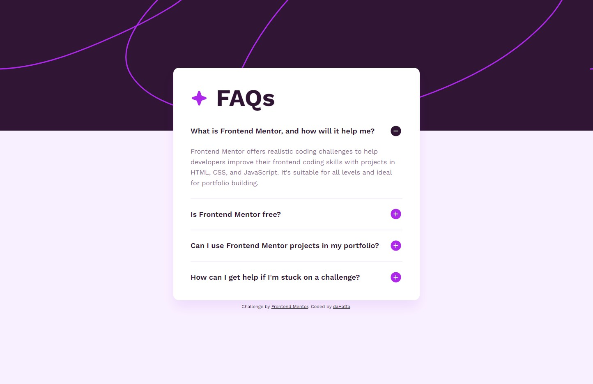

# Frontend Mentor - FAQ accordion solution

This is my solution to the [FAQ accordion challenge on Frontend Mentor](https://www.frontendmentor.io/challenges/faq-accordion-wyfFdeBwBz).

## Table of contents

- [Overview](#overview)
  - [The challenge](#the-challenge)
  - [Screenshot](#screenshot)
  - [Links](#links)
- [My process](#my-process)
  - [Built with](#built-with)
  - [What I learned](#what-i-learned)
  - [Continued development](#continued-development)
  - [Useful resources](#useful-resources)
- [Author](#author)

## Overview

### The challenge

Users should be able to:

- Hide/Show the answer to a question when the question is clicked
- Navigate the questions and hide/show answers using keyboard navigation alone
- View the optimal layout for the interface depending on their device's screen size
- See hover and focus states for all interactive elements on the page

### Screenshot



### Links

- Solution URL: [https://github.com/daHatta/fem-faq-accordion](https://github.com/daHatta/fem-faq-accordion)
- Live Site URL: [https://dahatta.github.io/fem-faq-accordion/](https://dahatta.github.io/fem-faq-accordion/)

## My process

### Built with

- Semantic HTML5 markup
- CSS custom properties
- Mobile-first workflow
- ARIA - Accessibility
- Vanilla JS

### What I learned

Using the Accordion Pattern from the ARIA guide was my greatest lesson as it also helps to navigate between
the single segment via Keybord. The user is able to use the **Tab**-key to browse forward between the header.
To open a marked segment you press **Enter** or **Space**. Backward browsing is possible by pressing the **Tab**-
and **Space**-key.

The recommended markup:

```html
<h3>
  <button
    type="button"
    aria-expanded="true"
    class="faq-trigger"
    aria-controls="sect1"
    id="faq1id"
  >
    <span class="faq-question">
      What is Frontend Mentor, and how will it help me?
      <span class="faq-icon"></span>
    </span>
  </button>
</h3>
<div id="sect1" role="region" aria-labelledby="faq1id" class="faq-panel">
  <p class="faq-answer">
    Frontend Mentor offers realistic coding challenges to help developers
    improve their frontend coding skills with projects in HTML, CSS, and
    JavaScript. It's suitable for all levels and ideal for portfolio building.
  </p>
</div>
```

_Important recommendations are the role, the three aria-attributes and the elements used._

Using special css selectors were very handy for icon swaps.

```css
.faq-trigger[aria-expanded="true"] .faq-icon {
  background-image: url("../../assets/images/icon-minus.svg");
}

.faq-trigger[aria-expanded="false"] .faq-icon {
  background-image: url("../../assets/images/icon-plus.svg");
}
```

Changing classes or values of attributes via JavaScript to manipulate the DOM were a nice lesson.

```js
faqBtn.setAttribute("aria-expanded", "false");
region.classList.add("hidden");
currentRegion.classList.remove("hidden");
```

### Continued development

Making websites completely accessible and improving my JS skills according plane JS without any frameworks is something I am trying todo.
Nonetheless I am still putting Next.js into my focus for future projects.

### Useful resources

- [A (more) Modern CSS Reset](https://piccalil.li/blog/a-more-modern-css-reset/) - This article by Andy Bell helped me to reset websites for browser.
- [A Modern Sass Folder Structure](https://dev.to/dostonnabotov/a-modern-sass-folder-structure-330f) - This article by Technophile helped me to build up an architecture for sass.
- [Accordion Pattern](https://www.w3.org/WAI/ARIA/apg/patterns/accordion/) - The Accordion Pattern from the ARIA Authoring Practices Guide by the W3C
- [Google Fonts](https://fonts.google.com/specimen/Work+Sans) - Used Work Sans in this project.
- [classList](https://developer.mozilla.org/en-US/docs/Web/API/Element/classList) - Nice documentation about the classList property.
- [setAttribute()](https://developer.mozilla.org/en-US/docs/Web/API/Element/setAttribute) - Nice documentation about the setAttribute() method.
- [addEventListener()](https://developer.mozilla.org/en-US/docs/Web/API/EventTarget/addEventListener) - Nice documentation about the addEventListener() method.

## Author

- Frontend Mentor - [@daHatta](https://www.frontendmentor.io/profile/daHatta)
